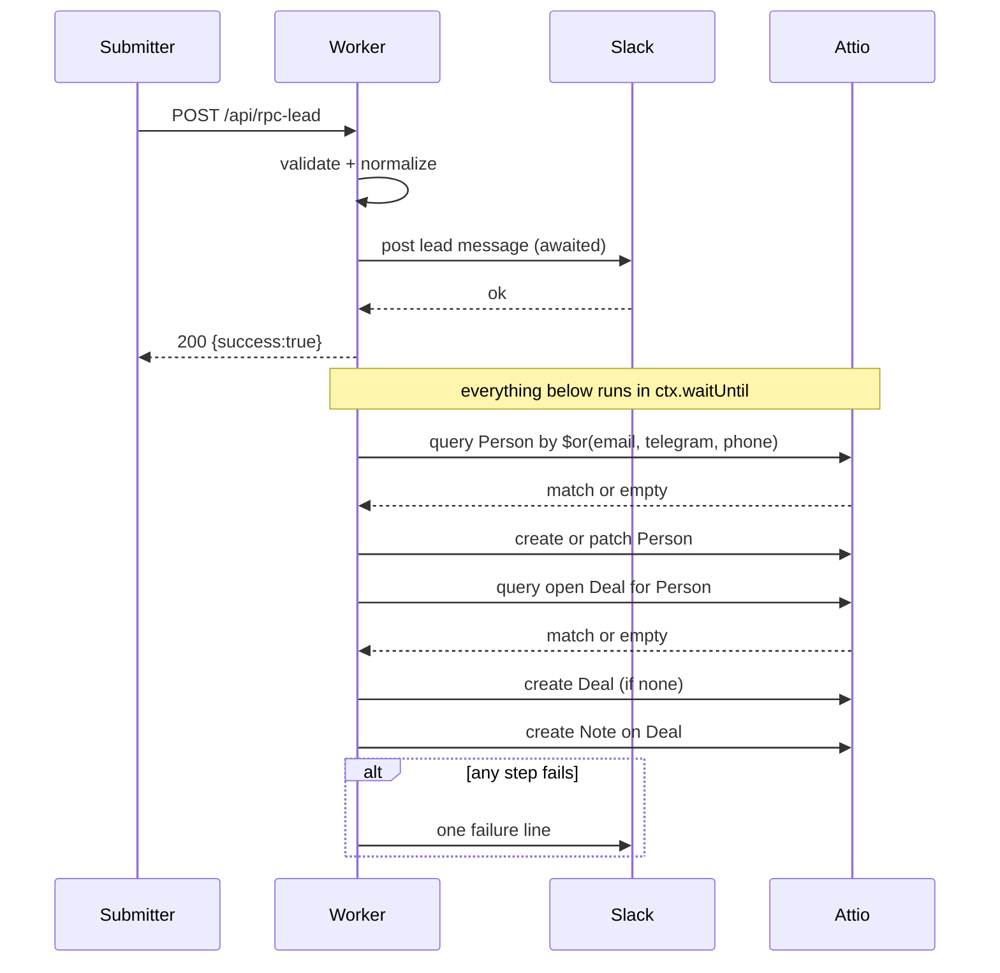
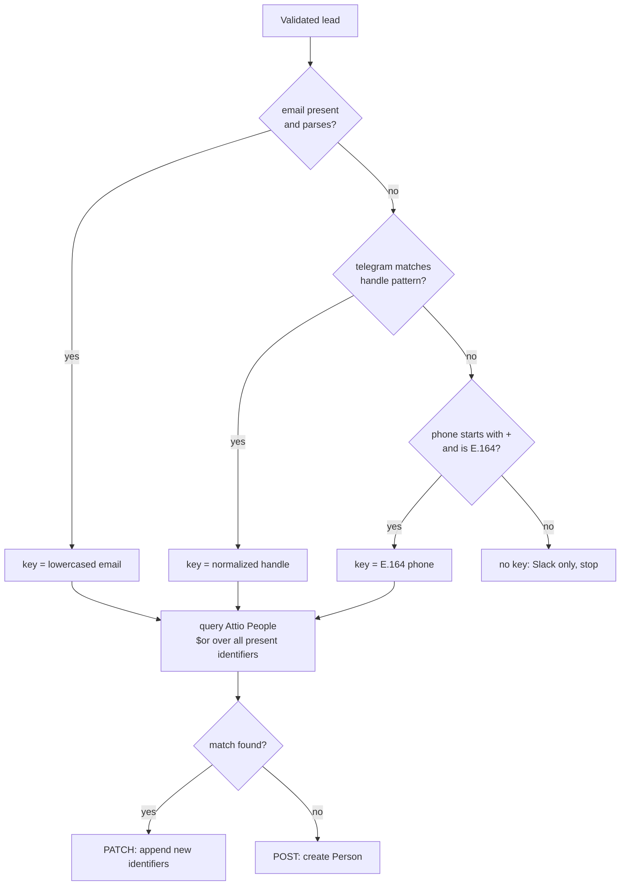

# Attio Lead Sync - Plan

## Goal Capsule

**Objective.** Every lead that supplies a normalizable identifier and is submitted through the site's two public forms lands, on a best-effort basis, in the new dedicated AckiNax Attio workspace as one Person and one live Deal, with the enquiry text attached - without changing what the submitter sees or weakening the Slack alert that the business currently relies on. Leads with no normalizable identifier (R5) and leads arriving while Attio is unavailable (F3) stay Slack-only by design.

**Authority hierarchy.** This plan's Key Technical Decisions govern. Where the plan is silent, follow the existing conventions in `worker/index.ts` (plain TypeScript, no framework, no dependencies, small pure helpers). Attio's published API semantics override any shape guessed here. The user's confirmed scope overrides any improvement the implementer notices along the way; new ideas go to Scope Boundaries, not into the diff.

**Stop conditions.** Stop and ask if: the Attio workspace rejects a schema change this plan assumes is possible (see R9 and Risk RK1); a design change would make the user-visible form response depend on Attio; or the work starts to require a queue, a database, or a new Cloudflare binding.

**Execution profile.** Sequential by dependency, with one exception: U3's manual prerequisites (enabling the Deals object, issuing keys, signing the DPA) are external and slow, so start them in parallel with U1. U1 through U3 are prerequisites with no user-visible behavior change. U4 through U7 build the sync. U8 is code-independent but is **not** free-floating: it must land before U7 is enabled in production, because that is the moment real personal data first reaches the processor.

**Tail ownership.** Standalone run: the executor owns branch, tests, review and PR.

---

## Product Contract

### Summary

The site's Cloudflare Worker currently receives two kinds of form submission (`POST /api/rpc-lead`, `POST /api/contact`), validates them, and posts a formatted message to a single Slack Incoming Webhook. Slack is the only record; there is no CRM behind it. This plan adds a best-effort write into a newly created, dedicated AckiNax Attio workspace: the submitter is resolved to a single Person across whichever contact channels they supplied, a Deal is opened on the AckiNax stage ladder (or their existing open Deal is reused), and the enquiry is attached as a Note. Slack keeps the delivery guarantee; a CRM failure is invisible to the submitter and surfaces as a single Slack line to the team. The plan also stands up the workspace schema itself, since the target workspace is empty.

### Problem Frame

Leads arrive today as Slack messages and nothing else. There is no pipeline, no history per person, and no way to see that the same operator enquired twice. A real observed case makes this concrete: one submitter arrived once with email, Telegram and phone, and again later with email only. In Slack these are two unrelated messages; in a CRM they should be one person with one deal and two enquiries.

Two properties of the current system shape the solution. First, the Worker has no database, no queue and no retry infrastructure, so anything it writes to a third party is a single best-effort attempt whose only durable backup is the Slack message. Second, the forms deliberately accept a lead who supplies **only** a Telegram handle or **only** a phone number - email is not guaranteed - which means the CRM identity key varies per submission and cannot be assumed.

The target workspace is brand new and empty, chosen over the existing shared SYKS workspace for a clean permission boundary. That decision moves workspace schema creation from "already done" to "part of this work".

### Requirements

- **R1.** Both `POST /api/rpc-lead` and `POST /api/contact` sync accepted submissions into the AckiNax Attio workspace.
- **R2.** The Attio write never changes the HTTP status, latency or body the submitter receives, and never prevents or delays the Slack post.
- **R3.** A submitter is resolved to a single Person by exact match on a normalized identifier, trying email, then Telegram handle, then E.164 phone.
- **R4.** Every identifier supplied on a submission is stored on the resolved Person without erasing identifiers recorded by earlier submissions.
- **R5.** A submission carrying no normalizable identifier is delivered to Slack and not written to Attio.
- **R6.** A submitter with no open Deal gets a new Deal at the first stage of the AckiNax ladder; a submitter who already has an open Deal has the enquiry appended to it rather than a second Deal opened.
- **R7.** The enquiry text and the submission's lead detail (project, tier, expected volume, channels supplied, source form) are attached to the Deal as a Note.
- **R8.** The Deal records which form produced it, and for RPC leads the Sub-Type matching the tier the submitter chose.
- **R9.** The AckiNax workspace schema - deal stages, Sub-Type options, lead source, Telegram attribute - is created by a re-runnable setup step rather than by hand.
- **R10.** Every lead whose Attio sync fails is individually identifiable in Slack, and the diagnostic detail behind those failures is throttled so an outage burst does not flood the channel.
- **R11.** The published privacy notice accurately describes CRM processing of enquiry data and states a retention period for unconverted leads.

### Key Decisions

These were settled in the planning conversation and enter implementation as constraints, not open questions.

- **KD1 - Write into the new dedicated AckiNax workspace, not the shared SYKS one.** *(session-settled: user-directed - chosen over staying in SYKS, which was recommended for its single interaction history, zero migration and reversibility via the existing Pipeline tag; a clean permission boundary for future collaborators was preferred.)* Governs R9, and is why the schema work exists at all.
- **KD2 - Both forms open Deals.** *(session-settled: user-directed - chosen over opening Deals for RPC leads only and landing contact-form messages as a Person plus note.)* Governs R1, R6.
- **KD3 - A returning submitter's enquiry appends to their existing open Deal.** *(session-settled: user-directed - chosen over opening a second Deal per submission.)* Governs R6, R7.
- **KD4 - Extend the Attio schema rather than folding Telegram and lead source into free text.** *(session-settled: user-directed - chosen over storing both in the Person description or the Note body.)* Governs R4, R8, R9.
- **KD5 - Sub-Type options are the site's RPC tiers.** *(session-settled: user-directed - Starter, Commercial, Dedicated/Managed and Managed Block Manager hosting; "Not sure yet" deliberately has no option and leaves the field blank. Market Maker Partnership was excluded as a type rather than a sub-type.)* Governs R8.
- **KD6 - Mirror the AckiNax stage ladder already designed in SYKS.** *(session-settled: user-directed - chosen over standing up only the stages lead intake strictly needs and shaping the rest by hand.)* Governs R6, R9.
- **KD7 - Spam hardening ships before Attio writes are enabled in production.** *(session-settled: user-directed - chosen over enabling writes now and accepting the planted-identifier risk (RK6), following the recommendation research and review both gave.)* Resolves Q4. This plan is fully implemented and locally verified regardless; KD7 gates *production enablement* of U7, not the build. Governs the Definition of Done.
- **KD8 - Add a one-line country-code hint under the phone field on both forms.** *(session-settled: user-directed - chosen over leaving the strict no-form-changes boundary in place, following the recommendation research and review both gave.)* Resolves Q5 and narrows Scope Boundaries. Copy only - no validation, markup structure, or behavior change beyond the added hint text.

### Key Flows

- **F1 - New submitter.** Form post → validate → normalize identity → Slack (awaited) → respond 200 → background: no Person match → create Person → no open Deal → create Deal → attach Note. Identity normalization runs before the response because U7 gates on the match key before scheduling any background work; the normalizers are pure and add no meaningful latency.
- **F2 - Returning submitter.** Form post → validate → normalize identity → Slack → respond 200 → background: Person matched → patch Person with any new identifiers → open Deal found → attach Note to that Deal.
- **F3 - Attio unavailable.** Form post → validate → Slack → respond 200 → background: Attio call fails or times out → single Slack failure line → nothing retried.

### Acceptance Examples

- **AE1.** A lead submits email `Frank+rpc@Example.COM`, Telegram `@msiimsii` and phone `+353899747961`. One Person exists afterwards, carrying the lowercased email, the normalized handle `msiimsii`, and the E.164 phone. One Deal exists, with one Note.
- **AE2.** The same human submits again with only `frank+rpc@example.com`. Still one Person; the Telegram handle and phone recorded by AE1 are **still present**; still one Deal; now two Notes.
- **AE3.** A lead submits with a Telegram handle only and no email. A Person is created keyed on the handle, a Deal is opened, and a later submission from the same handle appends rather than duplicating.
- **AE4.** A lead submits phone `07777 777777` and nothing else. The submission reaches Slack; nothing is written to Attio; the response is a normal success.
- **AE5.** Attio returns 500 on the Person write. The submitter still receives a success response, the Slack lead message is unaffected, and one additional Slack line names the failure.
- **AE6.** An RPC lead selects tier "Starter · shared endpoint". The resulting Deal carries Sub-Type "Starter · shared endpoint". A lead selecting "Not sure yet", and any contact-form lead, produces a Deal with Sub-Type left blank.

### Scope Boundaries

**In scope.** Both form endpoints; Person, Deal and Note writes; identity normalization and matching; the workspace schema setup; the Slack failure signal; the privacy notice correction.

**Not in scope.** Any change to form markup, fields or copy, **except** the one-line country-code hint under the phone field on both forms per KD8 - copy only, no new validation or structural change. Backfilling leads submitted before this ships. Any sync from Attio back into the site. Explicit management of Company records - Attio auto-creates or matches a Company from the Person's email domain and that behavior is accepted as-is. Deal value, forecasting, or currency configuration beyond a one-time manual setting.

### Deferred to Follow-Up Work

Each of these was surfaced by research, is a genuine improvement, and is deliberately held out of this diff.

- **Spam hardening (Turnstile, honeypot field, the GA `ratelimit` binding).** This change converts a spam submission from a Slack message you scroll past into a permanent CRM record, and repeated spam under one email quietly corrupts a real Person rather than creating obvious junk. **State the mitigation position honestly: nothing in this plan's scope reduces the number of spam records reaching Attio.** R5 excludes only submissions carrying no normalizable identifier, which any bot supplying a syntactically valid email clears; KTD7 stops an unknown select value failing a write rather than suppressing the record. The only volume control that exists is the per-isolate rate limiter already in `worker/index.ts`, which is evadable across isolates and which this plan does not improve. See Q4 - whether this should be a hard prerequisite rather than a follow-up is an open decision, not a settled one.
- **Worker observability.** `wrangler.jsonc` has no `observability` block, so the Worker emits nothing queryable and the Slack notice is the only failure signal.
- **A dry-run rollout stage** - log what would be written, write nothing, run against live leads for a few days before enabling writes.
- **`src/pages/Contact.tsx` double-submit.** It clears fields but leaves the form live, unlike `RpcLeadForm.tsx` which moves to a terminal state.
- **`compatibility_date` bump** from the pinned `2025-01-01`. Not required by anything here and it carries unrelated behavior deltas.
- **A "type"-level home for Market Maker Partnership.** It is not a Sub-Type and no form produces those leads, so it has no place in lead intake.

### Outstanding Questions

- **Q1 (deferred).** Retention period for unconverted leads. 24 months from last contact is a defensible B2B default and is what U8 will write unless directed otherwise. Attio has no auto-deletion, so this becomes a recurring manual task.
- **Q2 (deferred).** Whether Deal value currency should be set to EUR in the workspace. Site pricing is EUR; Attio's default is USD and currency is an attribute-level setting that may not be patchable via API. Manual UI setting, one time, not blocking.
- **Q4 - resolved as KD7.** Spam hardening ships before Attio writes are enabled in production.
- **Q5 - resolved as KD8.** The phone field gets a one-line country-code hint on both forms.
- **Q3 (deferred).** Whether to make Deal creation atomically idempotent. Unlike People, the Deals object **does** accept a custom unique attribute, so a deterministic per-submission ID on Deals would let the Deal be upserted rather than query-then-created, closing the sub-second double-submit race server-side with no database. It is deliberately not in this plan: with one Deal per person and open-Deal reuse (R6), the remaining race is narrow, and one researcher could not verify from an authoritative source that a *text* attribute accepts `is_unique`. U3's schema probe answers that; if it does, this becomes a small, well-scoped follow-up rather than a guess made now.

---

## Planning Contract

### Key Technical Decisions

- **KTD0 - The built-in Deal `stage` and the Sub-Type select are configured per KD1, KD5 and KD6 rather than re-derived here.** The dedicated-workspace choice is what removes the need for a pipeline discriminator; see KTD6.
- **KTD1 - Resolve the Person by query-then-write, not by upsert.** Attio's upsert (`PUT ...?matching_attribute=...`) requires a *unique* attribute, and its documented semantics replace the contents of every **other** multiselect attribute in the payload. Upserting by email while sending `phone_numbers` would therefore delete phone numbers recorded by an earlier submission - a direct violation of R4. A single query with an `$or` across the available identifiers, followed by create-or-patch, gives one code path for all three key types and appends rather than replaces. Chosen over upsert-by-email-with-branch: the branch costs a second code path and still needs a read to merge multiselects safely.
- **KTD2 - Match precedence is email, then Telegram, then phone; first exact hit wins; never match on name.** Exact matching on normalized keys is explainable and produces near-zero false positives. It will miss some true duplicates - that is the correct trade for a pipeline this size, where a missed merge costs seconds in Attio's merge UI and a false merge silently corrupts a real contact.
- **KTD3 - Do not auto-merge on a secondary-key conflict.** If a Person was matched on a secondary identifier (Telegram or phone) and the submission carries an email that differs from every email already on that record, they are different people: create a new Person rather than patching, and raise a "possible duplicate" line in Slack for a human to judge. This is implemented in U5, not merely asserted here - the same rule also decides the multi-match case, where the record matched by the highest-precedence identifier per KTD2 wins rather than whichever record Attio returned first.
- **KTD4 - No retries on writes; one retry on reads.** Attio publishes no idempotency key, and Deal creation and Note creation are not idempotent, so retrying a write is precisely the mechanism that double-creates. The Person and Deal *queries*, however, are reads that cannot double-create anything, and a failed read aborts the sequence before a single write happens - so a transient blip on the first call would otherwise discard the lead's CRM record for free. Retry each read once on 429, 5xx or network failure; never retry a write; never retry a 4xx. The Slack message remains the durable record and manual re-entry the recovery path.
- **KTD5 - The sync runs inside `ctx.waitUntil` with a per-call timeout.** The handler signature gains the `ExecutionContext` parameter it currently lacks. `ctx` is never destructured (that throws at runtime). The promise handed to `waitUntil` never rejects - it catches internally. Each Attio call carries its own `AbortSignal.timeout` of 5 seconds. The worst-case sequence is five calls (Person query, Person write, Deal query, Deal write, Note write), so 25 seconds bounds the whole chain inside the 30-second `waitUntil` budget with margin. Stating the arithmetic matters: an implementer picking a plausible-looking 10 seconds per call produces exactly the mid-sequence cancellation this decision promises cannot happen.
- **KTD6 - The built-in Deal `stage` attribute carries the AckiNax ladder directly.** No `Pipeline` discriminator, no parallel custom stage attribute. This is the payoff of KD1: in the shared workspace a discriminator was necessary because four sales motions share one Deals object; in a dedicated one, `stage` simply means the AckiNax stage.
- **KTD7 - Status and select values are drawn from a fixed allowlist in code, never passed through from user input.** Attio errors on an unknown status or select value rather than creating it, so a free-text tier reaching the API fails the whole Deal write. The Worker maps the submitted tier onto a known Sub-Type option or leaves it blank.
- **KTD8 - Free-text and unvalidatable detail goes in the Note, not into typed attributes.** Attio validates phone values against E.164 and rejects the whole record write on a malformed one. Anything that cannot be normalized with confidence is preserved as readable text in the Note, where nothing is validated.
- **KTD10 - Two Attio keys, not one.** The setup script needs object-configuration write to reshape the schema; the Worker needs only record read/write and note write. Issuing one key for both would leave a long-lived credential in the production Worker that can archive stages and rewrite attributes - structural control of the CRM rather than record access - recoverable only by rotation the plan would then have to define. The setup key stays local and is never stored as a Worker secret.
- **KTD11 - The integration lives in the Worker, accepting best-effort delivery.** The alternative was routing submissions through an external automation platform that retries and guarantees delivery. The Worker was chosen because it keeps one deployable, one secret and no new vendor, and because at a handful of leads a week the Slack message is an adequate durable record. The cost is owned rather than hidden: no retry on writes, possible partial records, and manual re-entry as the recovery path. This is why the Goal Capsule forbids reaching for a queue or a database mid-implementation - that would be a different decision, taken deliberately, not a drift.
- **KTD9 - Schema setup is a re-runnable script that treats "already exists" as success.** Attribute creation returns a slug-conflict error on re-run; option creation conflicts on duplicate title. The script is idempotent by treating those as no-ops. There is no delete in the Attio schema API - unwanted defaults are archived, never removed.

### High-Level Technical Design

Request path and background path, showing what the submitter waits for and what they do not:

Identity resolution and the sync gate - the decision points that determine whether a lead reaches Attio at all, and under which key:

The AckiNax stage ladder written into the workspace, mirroring the pipeline already designed in SYKS: **New Lead → Qualifying → Technical Evaluation → Commercial Discussion → Contract → Won / Lost.** "Open" for the purposes of R6 means any stage other than Won or Lost.

Sub-Type options, per the confirmed decision: Starter · shared endpoint, Commercial · dedicated endpoint, Dedicated / Managed · fully managed, Managed Block Manager hosting. The site's fifth tier option, "Not sure yet", intentionally has no Sub-Type and leaves the field blank for manual triage.

### Assumptions

- **A1.** The AckiNax workspace is empty apart from Attio's defaults. The Attio connector was not reachable from the planning session, so the live schema was never read; U3 reads it first and adapts rather than assuming.
- **A2.** An API key can be issued for that workspace with scopes covering record read/write, note write, object configuration read/write, and workspace member read.
- **A3.** The workspace has exactly one member (the owner), who becomes the Deal owner. Deal owner is a required attribute with no "unassigned" value.
- **A4.** Traffic is a handful of leads per week, so Attio's rate limits (100 reads/s, 25 writes/s) are irrelevant and the read-before-write race in R6 is acceptable.

### Risks and Dependencies

- **RK1 - People cannot carry a custom unique attribute, so Telegram can never be an upsert key.** Two researchers working in separate contexts converged on this independently, both citing Attio's help centre: custom unique attributes are supported on custom objects and on Deals, Users and Workspaces, but not on People or Companies. `email_addresses` is therefore the only key People can be upserted against, which is exactly why KTD1 uses query-then-write for every path rather than upserting the email case and hand-rolling the rest. U3 still probes the live workspace to confirm, because the whole matching design rests on it.
- **RK2 - The Deals object is disabled by default in a new Attio workspace and can only be enabled by an admin in the UI.** No API was found to enable it. This is a manual prerequisite that blocks U3 onward.
- **RK3 - Stage ordering may not be settable via the API.** Status creation is documented; reordering is not. The ladder may need its order fixed once in the UI.
- **RK4 - Partial writes are permanent, not self-healing.** Any mid-sequence failure - not just a timeout - can leave a Person with no Deal. That first enquiry's Note is then lost for good: U6 attaches a Note for the current submission only and nothing replays earlier ones, so a returning submitter's Deal carries only their later enquiry, and a one-time submitter sits in the CRM as a Person with no Deal indefinitely. Recovery is the same manual re-entry from Slack that KTD11 accepts. Do not describe this as self-healing.
- **RK5 - Spam becomes permanent, and this plan does not mitigate it.** See Deferred to Follow-Up Work and Q4. R5 filters only identifier-less submissions and KTD7 only guards a select value; neither reduces spam record volume. The worst case is not junk records but quiet corruption of a real contact, since a bot submitting a real prospect's email appends identifiers and notes to that prospect's existing Person.
- **RK6 - Identifiers can be planted on a real Person.** Because R4 appends every supplied identifier to a matched Person, anyone can attach a phone number or Telegram handle of their choosing to a real prospect's record by submitting either public form under that prospect's email address. Attio offers no removal signal and sales staff cannot distinguish a planted channel from a supplied one. U7 surfaces enrichment of a pre-existing Person in Slack so a human sees it; that is visibility, not prevention, and it is another argument for Q4.
- **Dependency.** An Attio API key stored as a Worker secret (`wrangler secret put`, plus `.dev.vars` locally - already gitignored). A missing key must degrade to Slack-only, never to a 503, unlike the existing Slack webhook behavior.
- **Dependency.** Attio's Data Processing Addendum signed before live PII flows, given U8 names Attio as a processor.

### Sources and Research

- Attio REST API v2: upsert vs create semantics and the multiselect-replacement footgun; record query filtering with `$or` across attributes; note creation requiring `parent_object`, `parent_record_id`, `title`, `format`, `content`; attribute, select-option and status creation; archive-only schema management; rate limits and the `{status_code, type, code, message}` error envelope; the absence of any inbound idempotency key. No REST API deprecations found for 2026.
- Attio standard objects: People (`email_addresses` unique and multiselect; no Telegram attribute; auto Company matching from email domain), Deals (disabled by default; `name`, `stage`, `owner` all required; value defaults to USD).
- Attio value formats: phone numbers validated against E.164 and requiring a leading `+`; status and select values erroring on unknown titles rather than auto-creating; actor-reference settable by workspace-member email.
- Cloudflare Workers: `ctx.waitUntil` continues execution up to 30s after the response, never destructure `ctx`, unawaited promises are cancelled silently; secrets via `wrangler secret put` and `.dev.vars`; nothing about outbound `fetch` is gated by the pinned `compatibility_date`.
- Repo: `worker/index.ts` is the whole server surface; `handleRpcLead` and `handleContact` are already near-duplicates; `src/lib/rpcLead.ts` holds the Zod schema the Worker duplicates by hand; `worker/` sits outside every tsconfig `include` and outside Vitest's `include`, so it is currently neither type-checked nor testable.
- Research method: two researchers ran in separate contexts. They converged independently on the People unique-attribute constraint (RK1), on `ctx.waitUntil` mechanics, on E.164 rejection killing the whole record write, on Deals being disabled by default, and on the absence of any inbound idempotency key - one of them confirming that last point by searching the live OpenAPI specification directly. Where their Attio detail differed, the account read from the published specification was preferred over the one assembled from search summaries.

---

## Implementation Units

### U1. Make the Worker testable and factor out shared lead handling

**Goal.** Give the Worker a type-checked, test-reachable home and remove the duplication between the two handlers, so the Attio work is added once rather than twice.

**Requirements.** Enables R1, R2. No behavior change.

**Dependencies.** None.

**Files.**
- `package.json` - add `wrangler` as a devDependency (it carries the Workers types and the CLI U3 needs); add a `typecheck` script
- `vitest.config.ts` - extend `include` to reach `worker/**/*.{test,spec}.ts` **and** run those files under the node environment
- `tsconfig.worker.json` (new) - standalone config covering `worker/**`, not a project reference
- `worker/lead.ts` (new) - shared shapes, trimming/truncation, contact-channel validation
- `worker/index.ts` - use the shared module; add `ctx: ExecutionContext` to the `fetch` signature
- `worker/lead.test.ts` (new)
- `src/lib/rpcLead.ts` - export the shared field-length limits and the email pattern
- `src/test/rpc-lead.test.ts` - only if exporting those constants disturbs it

**Approach.**
1. Install the Workers types first. Neither `wrangler` nor `@cloudflare/workers-types` is currently a dependency and there is no `deploy` script, which means `ExecutionContext` has no definition to resolve against and `wrangler secret put` (U3's runbook) has no local binary. Adding `wrangler` as a devDependency covers both.
2. Add the Vitest include glob **and route `worker/**` at the node environment**. The existing jsdom setup is not fine for this: `AbortSignal.timeout`, which U4's client depends on, is undefined under the pinned jsdom, so every U4-U7 test would throw before asserting anything. This was confirmed by running the suite, not inferred.
3. Make `tsconfig.worker.json` standalone and add a `typecheck` script that runs it with `--noEmit`. A project reference from `tsconfig.json` would be inert: the existing referenced projects lack `composite`, and nothing in the current toolchain type-checks the Worker at all - `vite build` compiles only `src/`, and Wrangler bundles the Worker at deploy time without a gate. Without the script, this unit's stated goal is not delivered.
4. Lift the duplicated validation and field-truncation from `handleRpcLead` and `handleContact` into `worker/lead.ts`, keeping the RPC-only fields (project, tier, volume) as an extension of the common shape.
5. **Share the constants, not the schema.** Export the field-length limits and the email pattern from `src/lib/rpcLead.ts` and have `worker/lead.ts` apply them as truncation. Do not import `rpcLeadSchema` itself: it rejects over-length fields where the Worker truncates them, so reusing it would turn currently-successful submissions into 400s while this unit claims no behavior change; it pulls Zod into a Worker the Goal Capsule says stays dependency-free; and being a `ZodEffects` (it ends in `.superRefine`) it exposes no `.pick`/`.extend`/`.shape`, so no shared base shape can be derived from it without refactoring it first.
6. Add the third `fetch` parameter. Do not destructure it anywhere.
7. Leave Slack message construction and the 400/405/429/502/503 responses exactly as they are.

**Patterns to follow.** The existing `precheck` helper is the model for a shared guard. Keep the module dependency-free and free of Workers-specific globals so it stays testable under jsdom.

**Test scenarios.**
- A valid RPC payload parses into the shared shape with all fields trimmed.
- Fields exceeding their maximum are truncated to the documented lengths rather than rejected.
- A payload with a message but no email, Telegram or phone is rejected.
- A payload with a malformed email is rejected; one with no email but a Telegram handle is accepted.
- Covers AE4. A payload whose only channel is an unnormalizable phone is still *accepted* by validation - the Attio gate, not validation, is what excludes it later.

**Verification.** `bun run test` passes including the new file; `bun run typecheck` passes over `worker/`; `bun run build` succeeds; both endpoints behave identically to before for the existing cases, including that an over-length field is still truncated rather than rejected.

### U2. Identity normalization and match-key selection

**Goal.** Turn free-text contact fields into normalized identifiers, and decide which one keys the lead - or that none does.

**Requirements.** R3, R5. Governs AE1, AE3, AE4.

**Dependencies.** U1.

**Files.**
- `worker/identity.ts` (new)
- `worker/identity.test.ts` (new)
- `src/components/RpcLeadForm.tsx` - add the country-code hint under the phone field (KD8)
- `src/pages/Contact.tsx` - same hint, same wording

**Resolved per KD8.** The Problem Frame names phone-only leads as a deliberately supported case, yet step 2 excludes any phone written without a country code - which is how most people type a number when nothing asks otherwise. The existing placeholder (`+1 555 000 0000`) models it but nothing calls it out. Add a one-line hint under the phone field in both `src/components/RpcLeadForm.tsx` and `src/pages/Contact.tsx` (e.g. "Include your country code, e.g. +41 79 123 45 67") - copy only, no new validation. This is the only form-markup change this plan makes; everything else about the forms stays untouched.

**Approach.**
1. `normalizeEmail` - trim and lowercase the whole string. Do **not** strip plus-addressing or dots; those are Gmail-specific and applying them universally merges genuinely distinct addresses.
2. `normalizePhone` - strip everything except digits and a leading `+`; accept only if the result is valid E.164. A number without a leading `+` is **not** a match key - inferring a country from a bare `0612345678` is the highest-risk false-merge available here, and the visitor's location is not the number's country. The original text is preserved for the Note.
3. `normalizeTelegram` - lowercase, strip a leading `@` and any `t.me/` or `https://t.me/` prefix and trailing slash, then require Telegram's own username rule: opens with a letter, then letters, digits or underscores, five to thirty-two characters overall. Anything failing it is free text, not a handle.
4. `chooseMatchKey` - apply KTD2 precedence and return the key and its kind, or nothing.
5. No new dependency. A phone-parsing library would be an order of magnitude larger than this Worker and would happily guess where the guard above correctly refuses.

**Test scenarios.**
- `Frank+rpc@Example.COM` normalizes to `frank+rpc@example.com`; plus-addressing survives.
- `+41 79 123 45 67` normalizes to E.164; `07777 777777` and `0612345678` yield no phone key.
- `@Frank`, `t.me/frank`, `https://t.me/frank/` all normalize to `frank`; a four-character handle and a handle with spaces yield nothing.
- Precedence: a lead with all three channels keys on email; email absent keys on Telegram; only an unnormalizable phone yields no key at all.
- Empty strings and whitespace-only values yield no key and never throw.
- Role addresses such as `info@acme.com` still produce a key - one shared record beats many duplicates.

**Verification.** Table-driven tests over the cases above pass. No network, no Workers globals.

### U3. Stand up the AckiNax workspace schema

**Goal.** Create the stage ladder, Sub-Type options, lead source and Telegram attribute in the empty workspace, reproducibly.

**Requirements.** R9. Enables R6, R8.

**Dependencies.** U1 for the `wrangler` binary; `src/lib/rpcLead.ts` for the tier vocabulary. Not U2 - U2 produces identity normalization, which this unit does not use. Blocked by the manual prerequisites below, which are external and slow, so start them alongside U1.

**Files.**
- `scripts/attio-setup.ts` (new)
- `package.json` - add an `attio:setup` script so the runbook is reproducible
- `Docs/runbooks/attio-workspace-setup.md` (new) - manual prerequisites, how to run the script, and the standing retention task
- `worker/attio/schema.ts` (new) - option titles, stage names, and the resolved Deal-owner reference, shared by the script and the Worker
- `src/lib/tiers.ts` (new) - `TIER_OPTIONS` moved here so `src/lib/rpcLead.ts` and `worker/attio/schema.ts` share one source

**Approach.**

*Manual prerequisites, documented in the runbook and done before the script runs:*
1. Enable the Deals object in the workspace (admin, objects settings - no API exists for this).
2. Issue **two** keys, per KTD10. A *setup* key with object-configuration read/write and workspace-member read, used only by this script from a local shell and never stored as a Worker secret. A *runtime* key with record read/write and note write only, which is the one placed via `wrangler secret put` (the binary arrives with U1's devDependency) and mirrored into the already-gitignored `.dev.vars`. Record the rotation and revocation step for the runtime key in the runbook.
3. Sign Attio's Data Processing Addendum, and record in the runbook where Attio processes the data and which transfer mechanism the DPA names - U8 cannot write accurate geography wording without both facts.
4. Optionally set Deal value currency to EUR in the UI (see Q2).

*Script, run once against the workspace and safely re-runnable:*
5. Read the current schema first and report it - this is also how A1 and RK1 get resolved from fact rather than assumption. Probe two things specifically and record both answers in the runbook: whether People accepts a unique custom attribute (expected: no - RK1), and whether Deals accepts a unique *text* attribute (expected: yes, which would answer Q3). Do not build on either result now.
6. Reshape the Deal `stage` statuses into the AckiNax ladder. The workspace ships with defaults ("Lead", "In Progress", "Won", "Lost" or similar); rename where a default maps onto a ladder stage, create the missing ones, and archive any default with no place in the ladder. Never delete - the API offers archive only.
7. Create the Deals `ackinax_sub_type` select, deriving its four option titles from the exported `TIER_OPTIONS` array (excluding "Not sure yet", per KD5) rather than retyping them - one character of hand-typed drift would silently blank Sub-Type on every RPC Deal while unit tests sharing the same typo still passed. Create a `lead_source` select with one option per form.
8. Create the People `telegram` text attribute. It is non-unique - see RK1.
9. Resolve the workspace member ID that will own Deals, print it, and write it into `worker/attio/schema.ts` as an exported constant - U6 needs it at runtime and a Markdown runbook is not reachable from code.
10. Treat conflict-on-existing responses as success throughout, so a second run is a no-op.

**Execution note.** Run this against the live workspace before writing U5-U7, and paste the printed schema into the runbook. The rest of the sync is built against what the workspace actually reports, not against this plan's assumptions.

**Test scenarios.** `Test expectation: none -- one-time setup script against a live external workspace; its correctness is established by the schema read in step 5 and the re-run no-op check below, not by unit tests.`

**Verification.** `ATTIO_API_KEY=<setup key> bun run attio:setup` (the script reads the key from `process.env`; `.dev.vars` is a Wrangler file and is not loaded by a plain bun process). Running it twice produces the same workspace state and no errors on the second run. The printed schema shows the seven ladder stages - Won and Lost are separate statuses - four Sub-Type options, both lead-source options, and the Telegram attribute. The runbook records the resolved owner ID, the printed schema, the RK1 and Q3 answers, Attio's processing region and transfer mechanism, and the retention review task.

### U4. Attio HTTP client

**Goal.** One place that knows how to talk to Attio: auth, timeouts, error shape, and the rule that nothing throws out of it.

**Requirements.** R2, R10.

**Dependencies.** U1.

**Files.**
- `worker/attio/client.ts` (new)
- `worker/attio/client.test.ts` (new)

**Approach.**
1. A small client built over an injected `fetch`-like function so tests need no network and no Workers runtime.
2. Bearer auth from the runtime key; JSON in and out; every call carries its own 5-second `AbortSignal.timeout` (KTD5). Tests for this module run under the node environment per U1 - `AbortSignal.timeout` does not exist under the repo's jsdom.
3. Map responses into a discriminated result - success with the parsed body, or failure carrying HTTP status and Attio's `code` and `message` where present, with the body truncated so an error echoing the payload back cannot flood a Slack line.
4. Never throw. Retry policy belongs to the caller, not here: the client exposes the result and U5/U6 apply KTD4 (one retry on reads, none on writes). A network error, an abort and a 500 all resolve to the same failure shape.

**Test scenarios.**
- A 200 with a well-formed body resolves to success with the parsed data.
- A 400 carrying an Attio error envelope resolves to failure preserving `code` and `message`.
- A 429 resolves to failure and triggers no second request.
- A rejected fetch and an aborted fetch both resolve to failure rather than throwing.
- An oversized error body is truncated.
- The API key appears in the request header and never in a returned error.

**Verification.** Tests pass with an injected fake; no call reaches the network.

### U5. Resolve and write the Person

**Goal.** Turn a normalized lead into exactly one Person record, enriching rather than overwriting.

**Requirements.** R3, R4. Governs AE1, AE2, AE3.

**Dependencies.** U2, U3, U4.

**Files.**
- `worker/attio/person.ts` (new)
- `worker/attio/person.test.ts` (new)

**Approach.**
1. Query People with an `$or` across every identifier the submission actually supplied, not just the match key - a lead keyed on email should still be found by a previously recorded handle.
2. No match: create the Person with name, and every normalized identifier present.
3. Single match, no conflict: patch the existing record so multiselect identifiers are appended rather than replaced. This is the requirement that rules out the upsert endpoint (KTD1) - sending a partial array there deletes the rest.
4. **Single match on a secondary identifier with a conflicting email: create a new Person, do not patch (KTD3).** If the record was found by Telegram or phone and the submission carries an email that differs from every email already stored on it, these are different humans, and patching would append a stranger's address onto a real contact - the exact corruption KTD2 and KTD3 exist to prevent. Raise the possible-duplicate flag instead.
5. More than one match: do not merge, do not guess. Select the record matched by the *highest-precedence* identifier per KTD2 (email, then Telegram, then phone) - not whichever record the response happened to list first, since response order is not precedence order. Do not write a lower-precedence identifier that matched a different record onto the selected one. Flag the ambiguity upward so U7 can surface it (KTD3).
6. Send only sales-relevant fields. Never the client IP or user agent.
7. Omit a phone value that failed normalization rather than sending it - a malformed phone fails the entire record write (KTD8).

**Test scenarios.**
- Covers AE1. A three-channel lead with no existing match issues a create carrying all three normalized identifiers.
- Covers AE2. An email-only lead matching an existing Person issues an append-style update, and the request body does not contain a phone array that would replace the stored one.
- Covers AE3. A Telegram-only lead with no match creates a Person keyed on the handle.
- A lead whose phone failed normalization produces a request with no phone field at all.
- Covers KTD3. A Person matched by phone whose stored email differs from the submitted one produces a *create*, not a patch, plus the possible-duplicate flag.
- Two matching records - one by email, one by phone - select the email-matched record, issue exactly one write, and flag the ambiguity.
- A failed query is retried once (KTD4); a second failure resolves to failure and issues no write.
- The request body never contains IP or user-agent fields.

**Verification.** Tests assert on the exact request bodies produced, using the injected client from U4.

### U6. Resolve the Deal and attach the enquiry

**Goal.** Reuse the submitter's open Deal or open their first one, then record the enquiry on it.

**Requirements.** R6, R7, R8. Governs AE1, AE2, AE6.

**Dependencies.** U5.

**Files.**
- `worker/attio/deal.ts` (new)
- `worker/attio/deal.test.ts` (new)

**Approach.**
1. Query Deals associated with the resolved Person, filtered to stages other than Won and Lost. This read-before-write is racy in principle; at this volume it is fine, and it is the plan's actual duplicate-suppression mechanism rather than a guarantee (KTD4).
2. No open Deal: create one with a name identifying the person and their project or source form, the first ladder stage, the owner constant exported from `worker/attio/schema.ts` by U3, the association to the Person, the lead source, and - for RPC leads only - the Sub-Type mapped from the submitted tier through the allowlist (KTD7). An unrecognized or "Not sure yet" tier leaves Sub-Type unset (AE6).
3. Write only one side of the Person/Deal relationship; Attio maintains the inverse.
4. Attach the enquiry as a Note on the Deal, carrying the full detail R7 requires: the message text, project, **the submitted tier string**, expected volume, **the channels the submitter supplied**, the original unnormalized phone if it was rejected, and which form it came from. Tier matters most for exactly the leads whose Sub-Type is deliberately blank ("Not sure yet", contact-form) - without it, AE6 routes them to manual triage with nothing to triage on. Write the Note as **plaintext, not markdown**: the body is up to 2000 characters of unauthenticated submitted text, and rendering it would put attacker-supplied links into a CRM view staff read and click. Notes are never deduplicated by Attio, so this write happens exactly once per submission and is never retried.

**Test scenarios.**
- Covers AE1. No open Deal produces one create with stage, owner, Person association, lead source and Sub-Type set.
- Covers AE2. An existing open Deal produces no Deal create and one Note against that Deal.
- A Person whose only Deals are Won or Lost gets a new Deal.
- Covers AE6. Each of the four mapped tiers yields its Sub-Type; "Not sure yet" and an unrecognized string yield no Sub-Type field; a contact-form lead yields none.
- The Note body carries the enquiry text, the expected volume, and a phone that failed normalization.
- Covers R7. A "Not sure yet" RPC lead produces a blank Sub-Type but a Note containing the submitted tier string and the channels supplied.
- A message containing markdown link syntax is stored verbatim rather than rendered.
- The Deal create carries the owner constant.
- A failed Deal query stops the sequence without creating a Deal or a Note.
- The Deal create sets only the Deal side of the association.

**Verification.** Tests assert request bodies and call ordering against the injected client.

### U7. Wire the sync into both endpoints

**Goal.** Run the whole sequence in the background on both routes, gated correctly, with one failure signal.

**Requirements.** R1, R2, R5, R10. Governs AE4, AE5.

**Dependencies.** U5, U6.

**Files.**
- `worker/attio/sync.ts` (new) - orchestrates person → deal → note and owns the failure signal
- `worker/index.ts` - call it from both handlers
- `worker/attio/sync.test.ts` (new)
- `wrangler.jsonc` - only if the Attio key needs declaring; do **not** make it a deploy-required secret, since a missing key must degrade to Slack-only
- `.dev.vars` is gitignored already; the runbook from U3 documents `wrangler secret put`

**Approach.**
1. Gate before scheduling any background work: skip when the runtime key is unset, and skip when the lead has no match key (R5). Neither is an error and neither changes the submitter's response - but neither is silent either. Append a short CRM-status marker to the Slack lead message itself ("CRM: skipped - no key", "CRM: skipped - no match key"), because a dropped secret would otherwise turn the entire feature off with no signal anywhere, and R5 skips would be indistinguishable from synced leads. The gate decision is known before the lead message is built, so this costs nothing.
2. Hand the sequence to `ctx.waitUntil`. Do not destructure `ctx`. The promise catches internally and never rejects (KTD5).
3. Post the Slack lead message before scheduling, exactly as today, so the awaited Slack behavior and its 502 path are untouched. **Schedule the sync even when that post failed** - a Slack outage must not also lose the CRM record, which is the one case where KTD11's "Slack is the durable record" does not hold. Suppress the Attio failure notice in that case; it would target the same dead webhook.
4. On failure, throttle the *detail*, never the *identity*. Every failed sync posts a minimal line naming the lead ("not synced: <identifier>"), because manual re-entry from Slack is impossible if the team only learns that lead #1 failed and never hears about #2 onward. The step, status and truncated error body are posted at most once per 60-second window, mirroring `RATE_WINDOW_MS` in `worker/index.ts`. The throttle state is per-isolate and therefore best-effort, matching that limiter's honesty about its own limits. Never notify about a failed notification.
5. Post on success in exactly two cases, and otherwise stay quiet: when U5 raises the possible-duplicate flag (KTD3 asks for a human judgement that a failure-only channel would never deliver), and when U5 appended an identifier to a *pre-existing* Person, so an unexpected enrichment of an established contact is visible (RK6).

**Execution note.** Prove the response-independence property first - a test asserting the endpoint still returns success while every Attio call fails is the one that protects R2 through future edits.

**Test scenarios.**
- Covers AE5. Every Attio call fails; the handler's response is still success and the Slack lead post is unaffected.
- Covers AE4. A lead with no normalizable key schedules no background work and posts no failure line.
- An unset API key schedules no background work and posts no failure line.
- A successful sync posts no Slack failure line.
- Two failures inside the window both post an identifying line; only the first carries the step and status detail.
- A failure at the Deal step still leaves the Person written - and the detail line names the Deal step.
- A fully successful sync carrying the possible-duplicate flag posts exactly one line.
- A successful sync that appended an identifier to a pre-existing Person posts a line naming the identifier added.
- A failed Slack lead post still schedules the sync, and posts no Attio failure notice.
- Each endpoint-level test sets a distinct `cf-connecting-ip`; the module-level limiter in `worker/index.ts` keeps per-isolate state across a test file and would 429 the seventh request for any one IP.
- The sequence stops at the first failed step rather than continuing.

**Verification.** `bun run test` passes. Manual check against the live workspace using AE1 then AE2: one Person, one Deal, two Notes, and the Telegram handle and phone from the first submission still present after the second.

### U8. Correct the privacy notice

**Goal.** Make the published notice accurate now that enquiry data goes to a third-party CRM.

**Requirements.** R11.

**Dependencies.** No code dependency, but it must land **before U7 is enabled in production** - that is when real personal data first reaches the processor, and shipping the sync against a notice whose recipient list contains no CRM is the defect R11 exists to prevent.

**Files.**
- `src/pages/PrivacyPolicy.tsx`

**Approach.**
1. The disclosure section currently reads as an exhaustive recipient list - payment provider, node operators, IT and hosting providers in Switzerland and the EEA, regulators. A CRM fits none of those categories and the geography statement stops being accurate. Add CRM and customer-relationship tooling to the recipient list, and state the processing region and transfer mechanism **as recorded in U3's runbook from the signed DPA** rather than inventing wording - the section promises Standard Contractual Clauses for transfers out of Switzerland/EEA, a claim the site cannot support on a guess.
2. The retention section covers contractual records and server logs but not an unconverted lead sitting in a CRM. State a period (Q1: 24 months from last contact unless directed otherwise), and add the matching review task to U3's runbook - the query that lists unconverted Deals past the period, the deletion step, the cadence and the owner. Attio has no auto-deletion, so a published period with no procedure behind it just moves the notice from one inaccuracy to another.
3. The "contacting us" section says "name, email address and any other information you choose to provide" - name Telegram and phone explicitly. This one is a rider: the forms already collect both today, so the gap predates this change rather than being caused by it.
4. Update the effective date.
5. Lawful basis needs no change: pre-contractual steps at the data subject's request, plus legitimate interest for retaining the sales record. Do not add a consent claim - none was collected and consent is withdrawable.

**Test scenarios.** `Test expectation: none -- static copy change with no behavior.`

**Verification.** `bun run build` succeeds and the rendered page shows the corrected recipients, the retention period and the new date.

---

## Verification Contract

- `bun run test` - the full Vitest suite, including the new `worker/**` tests reachable via the U1 include change and running under the node environment. This is the primary gate; the pure modules in U2, U4, U5 and U6 are where the real risk lives.
- `bun run typecheck` - added by U1. Without it nothing type-checks `worker/` at all.
- `bun run lint` - ESLint over `**/*.{ts,tsx}`, which already covers `worker/`. **Baseline: `main` already reports five errors, all in files this change does not touch.** The gate is no *new* errors relative to that baseline, not a clean exit - fixing the pre-existing shadcn and Tailwind findings is outside this scope.
- `bun run build` - Vite build must succeed; it is also the check for U8. Note it compiles only `src/` and proves nothing about the Worker.
- **Before any live-workspace run:** the signed DPA and U8's corrected notice must both be in place.
- **Manual end-to-end against the live workspace**, after U7 and before considering the work done: submit AE1 (email + Telegram + phone), then AE2 (same email only). Confirm one Person, one Deal, two Notes, and that the second submission did **not** wipe the phone or handle stored by the first. Then submit AE4 (unnormalizable phone only) and confirm Slack receives it and Attio does not.
- **Failure path**, exercised by temporarily pointing the API key at an invalid value: the form still succeeds and exactly one Slack failure line appears.
- The U3 setup script re-run producing a clean no-op.

## Definition of Done

**Global.**
- All eight units complete. `bun run test`, `bun run typecheck` and `bun run build` pass; `bun run lint` introduces no new errors against the five-error baseline on `main`.
- Attio's Data Processing Addendum is signed and U8's corrected privacy notice has shipped **before** the first live-workspace write or any production enablement of U7. Neither is optional and neither is "landed whenever".
- Per KD7, U7's Attio sync is implemented and locally verified as part of this plan, but is **not enabled against the production Attio key** until spam hardening (Turnstile, honeypot, the `ratelimit` binding - Deferred to Follow-Up Work) has shipped. Until then the runtime key stays unset in production, which U7's own gate (R5/KTD-gated skip) already handles safely and silently-but-visibly (the Slack CRM-status marker).
- Both endpoints return exactly what they returned before this change for every existing case, including the 400, 405, 429, 502 and 503 paths.
- No Attio call is awaited on the request path; no code destructures `ctx`; no promise is left floating outside `waitUntil`.
- Nothing retries an Attio write. Reads retry at most once.
- No test relies on `AbortSignal.timeout` under jsdom.
- The API key exists only as a Worker secret and never in tracked files - note that `.env` was tracked in this repo until it was removed in `e210655`.
- The manual end-to-end and failure-path checks in the Verification Contract have been run against the live workspace, not simulated.
- The U3 runbook records the resolved owner ID, the printed workspace schema, and the RK1 answer.
- Abandoned experimental code from approaches that did not pan out is removed, not left in the diff.

**Per unit.** Each unit's Verification block is satisfied before the next dependent unit begins. U3 in particular runs against the live workspace before U5 through U7 are written, so the sync is built against the schema that exists rather than the one this plan assumed.
